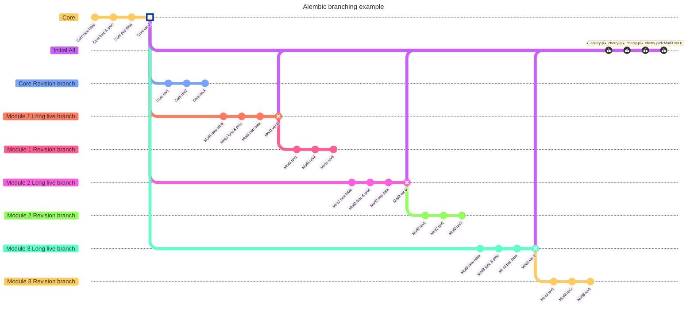

# Alembic Branches Example
An Alembic example on how to setup multiple DB modules using branches and dependencies with checked in sample files.

## Goals:
* Have a **single** tool to create the initial database and also apply the revisions to the database objects.
* Demostrate how to use branches and dependencies to implement modularization of the database objects.
* Support environment variable **`SQLALCHEMY_URL`** to overwrite default **`sqlalchemy.url`** in the `alembic.ini` file.


## My use case:
Instead of a pile of database object (tables), I want a way to organize them into modules that gives me the flexibility to install them either in a single database or in their own seperate database with an eye looking towards micro services.  In this example, I am using a single repository to implement the modularization of my database objects.  You could modularized your database object in different repositories but that is not what this example is about.

In this example I have a core common module and 3 other modules.  It is assumed that the core module is needed by the other modules.

This is my specific uses case and may not fit your use situation.  However, if you can gleam ideas off my example ... more power to you.


## Enhancements made:
* The `alembic.ini` have been tweaked.
* The `env.py` have been enhance to read the environment variable `SQLALCHEMY_URL` to over write the default set in `alembic.ini`.
* The `script.py.mako` have been enhance with extra imports to better integrate SQLAlchemy model and example.


## Setup:
1. Clone this repo using: `git clone https://github.com/elau1004/Alembic-Branches-Example.git`
2. Install `pipenv` using: `pip install pipenv`
3. Setup  your virtual environment and install the packages using: `pipenv install --dev`
4. Start your virtual environment using `pipenv shell`
5. Continue to the "Deployment example" section.

## Visual:
The following is to help you see the created branches: 


## Create the migration scripts using alembic:
The sample scripts that are checked in was generated and edited from the following execution of "`alembic revision`" command maximizing its CLI options.

1. Setup initialization of a **common core** branch.  This is meant to be a long living branch.
```
alembic revision -m "Init core create tables"      --rev-id init_core_newtable --head=base --branch-label INITCORE
alembic revision -m "Init core create replacables" --rev-id init_core_funcproc --head=INITCORE@head
alembic revision -m "Init core seed system data"   --rev-id init_core_popdata  --head=INITCORE@head
alembic revision -m "Init core revision 0"         --rev-id init_core_version0 --head=base --depends-on=init_core_popdata --branch-label CORE
```
2. Setup  initialization of a **module 1** branch.  This is meant to be a long living branch.
```
alembic revision -m "Init mod1 create tables"      --rev-id init_mod1_newtable --head=base --depends-on=init_core_newtable --branch-label INITMOD1
alembic revision -m "Init mod1 create replacables" --rev-id init_mod1_funcproc --head=INITMOD1@head
alembic revision -m "Init mod1 seed system data"   --rev-id init_mod1_popdata  --head=INITMOD1@head
alembic revision -m "Init mod1 revision 0"         --rev-id init_mod1_version0 --head=base --depends-on=init_mod1_popdata  --branch-label MOD1
```
3. Setup  initialization of a **module 2** branch.  This is meant to be a long living branch.
```
alembic revision -m "Init mod2 create tables"      --rev-id init_mod2_newtable --head=base --depends-on=init_core_newtable --branch-label INITMOD2
alembic revision -m "Init mod2 create replacables" --rev-id init_mod2_funcproc --head=INITMOD2@head
alembic revision -m "Init mod2 seed system data"   --rev-id init_mod2_popdata  --head=INITMOD2@head
alembic revision -m "Init mod2 revision 0"         --rev-id init_mod2_version0 --head=base --depends-on=init_mod2_popdata  --branch-label MOD2
```
4. Setup  initialization of a **module 3** branch.  This is meant to be a long living branch.

```
alembic revision -m "Init mod3 create tables"      --rev-id init_mod3_newtable --head=base --depends-on=init_core_newtable --branch-label INITMOD3
alembic revision -m "Init mod3 create replacables" --rev-id init_mod3_funcproc --head=INITMOD3@head
alembic revision -m "Init mod3 seed system data"   --rev-id init_mod3_popdata  --head=INITMOD3@head
alembic revision -m "Init mod3 revision 0"         --rev-id init_mod3_version0 --head=base --depends-on=init_mod3_popdata  --branch-label MOD3
```
5. Setup a shortcut dependency to upgrade all modules.  This is a development environment convenience.  I don't recommend to casually migrate all.
```
alembic revision -m "Init modules" --rev-id init_all_modules --head=base --branch-label INITALL --depends-on=init_mod1_popdata --depends-on=init_mod2_popdata --depends-on=init_mod3_popdata
```
6. Setup custom development specific.
```
alembic revision -m "Seed development data" --rev-id init_dev_popdata --head=base --branch-label INITDEV --depends-on=init_all_modules
```
7. Regular module migrations.  You need to know what you are doing by specifying the **branch**.  I don't recommend to casually migrate all.
```
alembic revision -m "CORE Rev1"  --rev-id core_rev1  --head=CORE@head
alembic revision -m "CORE Rev2"  --rev-id core_rev2  --head=CORE@head
alembic revision -m "CORE Rev3"  --rev-id core_rev3  --head=CORE@head

alembic revision -m "MOD1 Rev1"  --rev-id mod1_rev1  --head=MOD1@head
alembic revision -m "MOD1 Rev2"  --rev-id mod1_rev2  --head=MOD1@head
alembic revision -m "MOD1 Rev3"  --rev-id mod1_rev3  --head=MOD1@head

alembic revision -m "MOD2 Rev1"  --rev-id mod2_rev1  --head=MOD2@head
alembic revision -m "MOD2 Rev2"  --rev-id mod2_rev2  --head=MOD2@head
alembic revision -m "MOD2 Rev3"  --rev-id mod2_rev3  --head=MOD2@head

alembic revision -m "MOD3 Rev1"  --rev-id mod3_rev1  --head=MOD3@head
alembic revision -m "MOD3 Rev2"  --rev-id mod3_rev2  --head=MOD3@head
alembic revision -m "MOD3 Rev3"  --rev-id mod3_rev3  --head=MOD3@head
```


## Workflow:
1. Install the core module. 
1. Install the individual modules.
1. Optionally, create a shortcut to install all modules into the current database.  Usually, this is in a single development database.
1. Optionally, create a shortcut to populate the development database with test data.
1. Apply all the changes to bring the version of the database up to date.
1. Delete the applied scripts but keep the latest revision script.
1. Edit the latest revision script and set the `down_revision` value to point back to where we originally started from.  In my example it should be the "`init_XXXX_version0`" where `xxx` is the module mnemonic.


## Deployment example:
```
alembic heads | sort                # Display all the head branches from all the migration scripts.
alembic history                     # Display all the revision histories reflected from all the migration scripts.

alembic upgrade    INITCORE@head    # Upgrade only the CORE module.
alembic upgrade    INITMOD1@head    # Upgrade only the MOD1 module.
alembic upgrade    INITMOD2@head    # Upgrade only the MOD2 module.
alembic upgrade    INITMOD3@head    # Upgrade only the MOD3 module.
alembic current                     # Display the current versions applied to the database.

alembic upgrade    CORE@head        # Apply all revisions to the CORE module since initialization.
alembic upgrade    MOD1@head        # Apply all revisions to the MOD1 module since initialization.
alembic upgrade    MOD2@head        # Apply all revisions to the MOD2 module since initialization.
alembic upgrade    MOD3@head        # Apply all revisions to the MOD3 module since initialization.
alembic current                     # Display the current versions applied to the database.

alembic downgrade  CORE@base        # Downgrade the CORE module down to the base.
alembic downgrade  MOD1@-1          # Downgrade the MOD1 module by 2 revision from current.
alembic downgrade  MOD2@-2          # Downgrade the MOD2 module by 2 revision from current.
alembic downgrade  MOD3@-3          # Downgrade the MOD3 module by 3 revision from current.
alembic current                     # Display the current versions applied to the database.

alembic downgrade  base             # Downgrade all the above initialized modules.
alembic upgrade    INITALL@head     # Apply all revisions to the all the  modules.
alembic downgrade  base             # Downgrade all the above initialized modules.
alembic upgrade    INITDEV@head     # Create a new development databasse with all the modules with test data.

alembic upgrade    heads            # Becareful! It will upgrade all branches to their heads.  Strictly for illustration.
alembic current                     # Display the current versions applied to the database.
```
Once the upgrade is done, delete all the patching migration scripts except the latest script.
Update the latest branch scripts and change the value of "`down_revision`" to "`init_XXXX_version0`".


## Miscellanous:
* Once you have initialize the modules, your database objects are the latest according to the declarative model in `model.py`.  However, the version tacked in the `alembic_version` table is **not** the latest.  Therefore, you need to continue to fast forward all the revisions to arrive at each of the modules latest head revision.
* A sqlite3 database file shall be created in your repository root directory.  To start over, just delete this file.
* Try to avoid using "`alembic upgrade heads`".  You should be specific in apply your changes or you could create a big mess by applying the wrong branch into your environment.
* The script template does output commented out code that you could edit to enable the checking of CLI parameter passed via "`-x REVISE=`" in the `alembic upgrade` command.
* You do **not** need to install any package to get `sqlite3`.
* Do review the sample revision scripts.


## Limitations:
* This responsibility falls on the develoepr to understandwhat he/she is doing so that you do not mistakenly mix your production and development branches.  The same applies for working with `git`.
* More verbose and requires the specification of the branch to apply your changes to or passing in a CLI parameter.

